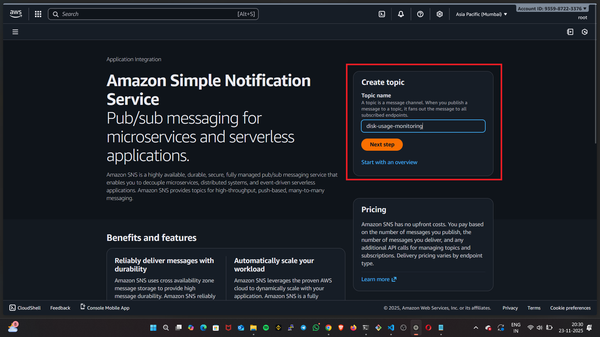
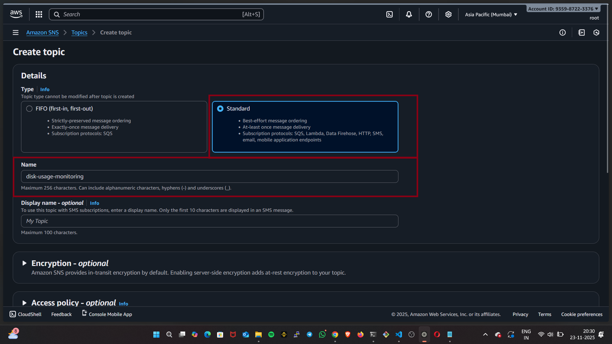
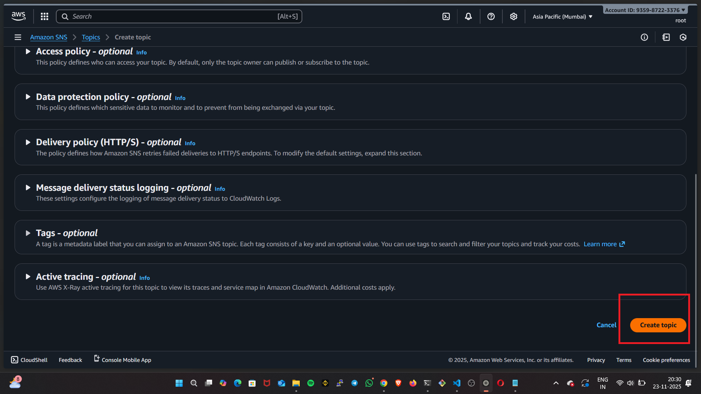
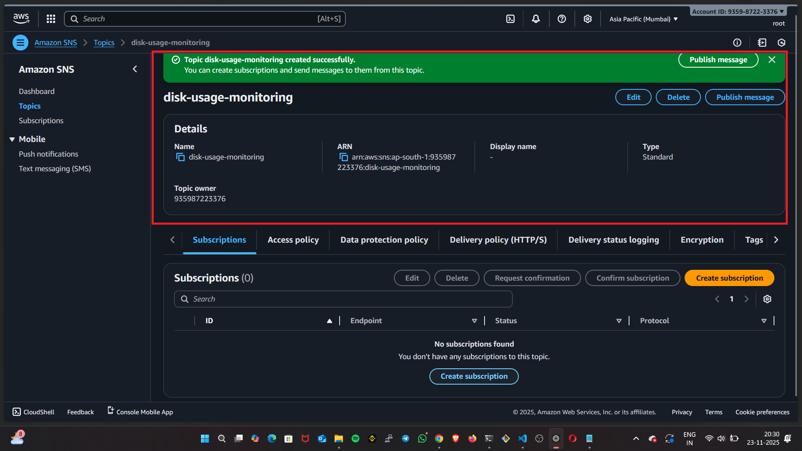
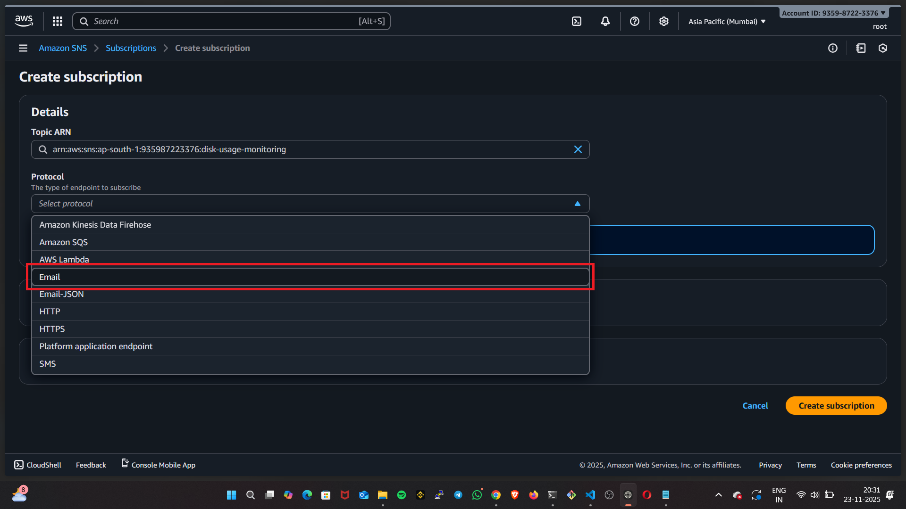
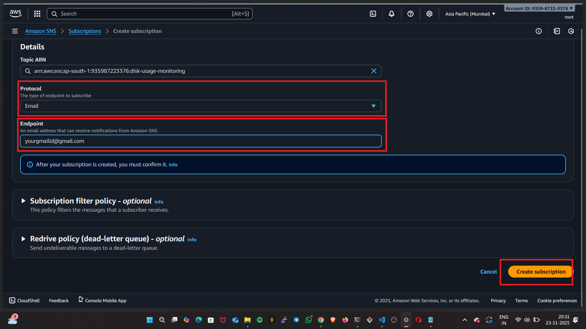
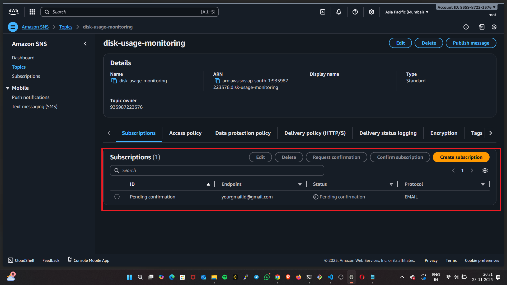
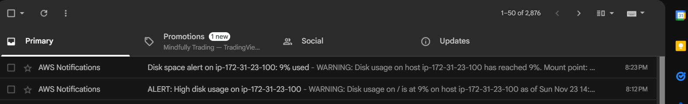
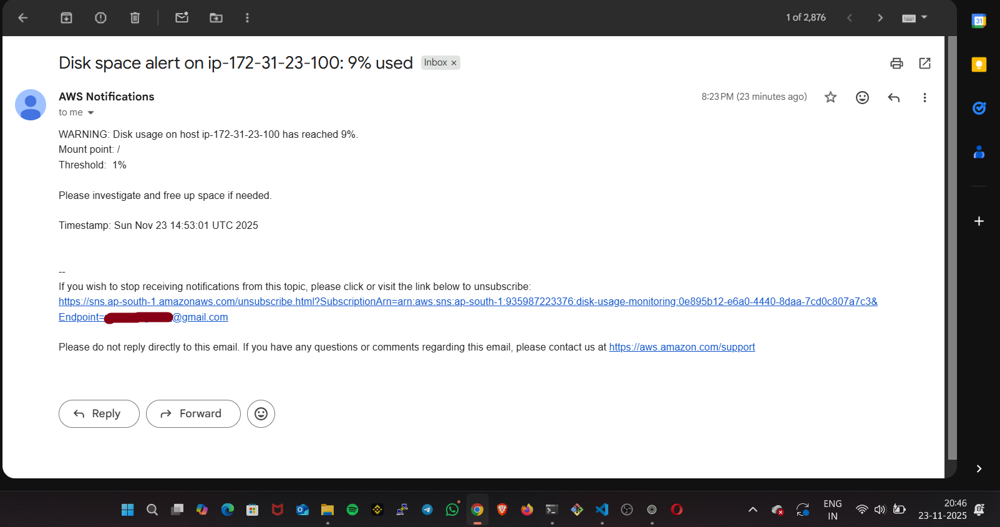

Here is the simplified and updated **README.md** with image placeholders included:

---

````markdown
```
# Disk Usage Monitoring with AWS SNS Alerts

This project provides a simple shell script that monitors disk usage on a Linux system and sends an **email alert via AWS SNS** when disk usage exceeds a configured threshold.

---

## 📌 Features

- Monitors a specified filesystem or mount point
- Sends alerts via **AWS SNS**
- Configurable disk usage threshold
- Can be automated using **cron**
- Lightweight and easy to deploy

---

## ⚙️ Requirements

Before using the script, ensure the following are installed and configured:

- **AWS CLI**
- **Bash**
- SNS Topic with an **email subscription**
- Permissions to execute scripts

Install AWS CLI if needed:

```bash
sudo apt-get install awscli  # Debian/Ubuntu
sudo yum install awscli      # RHEL/CentOS/Amazon Linux
````

Configure AWS CLI:

```bash
aws configure
```

Enter:

| Setting        | Example             |
| -------------- | ------------------- |
| AWS Access Key | `AKIA*********`     |
| AWS Secret Key | `abc123***********` |
| Default Region | `us-east-1`         |

---

## 🔔 SNS Setup

### 1. Create Topic (Manually in AWS SNS)



### 2. select standard



### 3. select option "create topic"



### 4. Topic successfully created



### 5. Create subscription and select protocol



### 6. Give your desired email-id and create subscription



### 7. subscription successfully created and then aws will send confirmation mail "click confirm" Done




👉 **Confirm the subscription** from your email inbox.

---

## 📝 Script

```
File: `disk_usage_monitor.sh`
```

---

## 🚀 How to Run

Make script executable:

```bash
chmod +x disk-usage-monitoring-alerting.sh
```

Run manually:

```bash
./disk-usage-monitoring-alerting.sh
```

---

## ⏰ Automate with Cron

To check every 1 minutes:

```bash
crontab -e
```

Add:

```bash
*/1 * * * * /path/to/disk-usage-monitoring-alerting.sh >> /var/log/disk_monitor.log 2>&1
```

---

## Outputs

### Email output



---




---

## 🧪 Testing

To force a test alert, temporarily set:

```bash
THRESHOLD=1
```

Run script again and verify SNS email.

---

## ❓ Troubleshooting

| Issue                | Fix                                 |
| -------------------- | ----------------------------------- |
| No email             | Check SNS subscription is confirmed |
| Script fails in cron | Use full paths for AWS CLI          |
| Missing AWS CLI      | Install AWS CLI                     |

---


## 🤝 Contributions

Pull requests and improvements are welcome!


---
